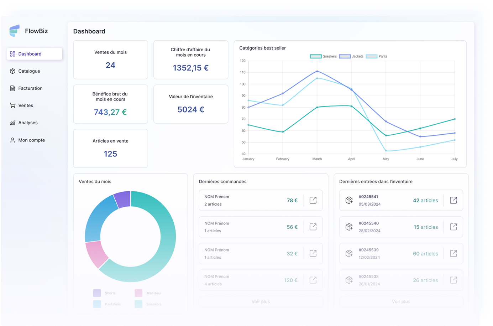
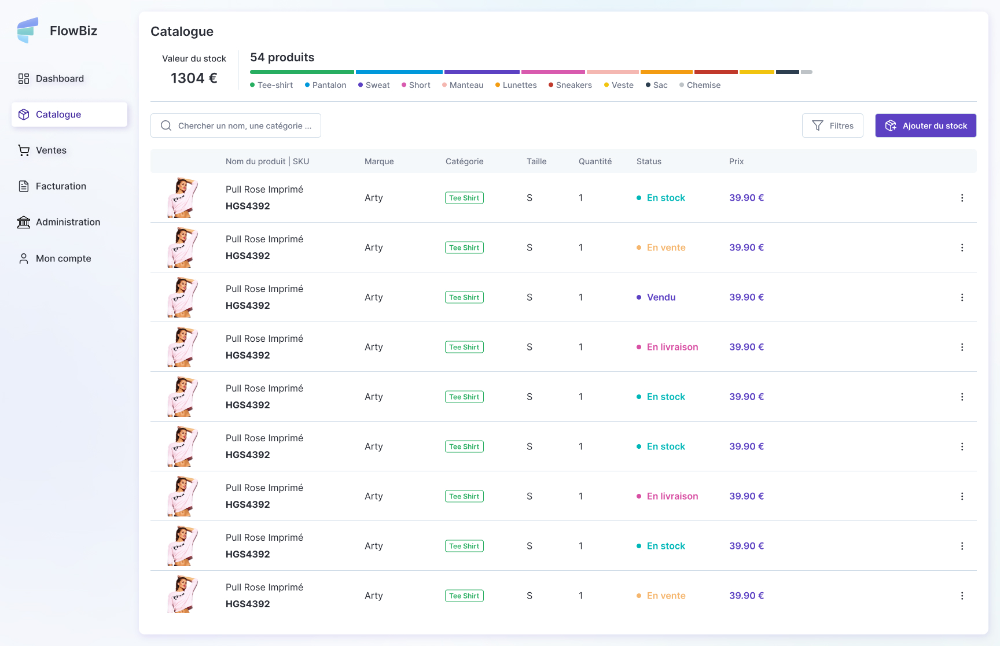
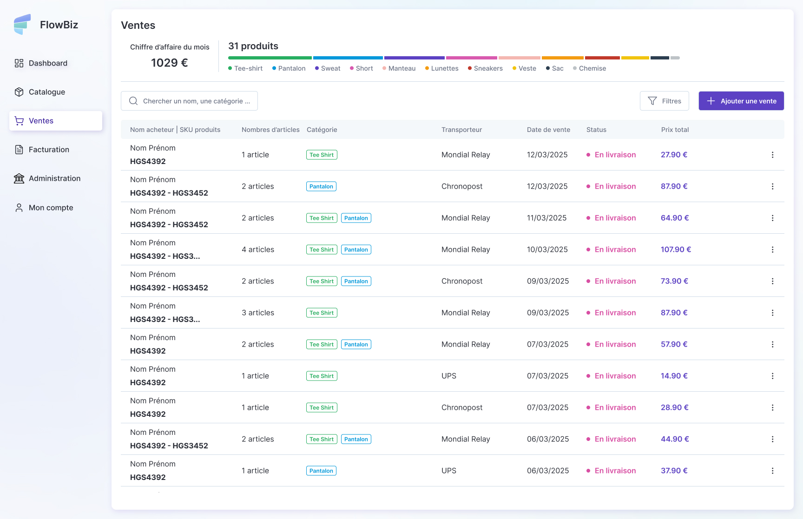

# FlowBiz
## À propos

FlowBiz est une application de comptabilité et de gestion de stock conçue spécifiquement pour les micro-entreprises. Elle offre une solution complète pour gérer vos inventaires, générer des factures et analyser vos données commerciales.

## Caractéristiques principales

- **Gestion de stock** : Suivez facilement vos produits, leur quantité et leur valeur
- **Gestion des ventes** : Enregistrez vos transactions et suivez vos revenus
- **Génération de factures** : Créez et exportez des factures professionnelles en PDF
- **Tableaux de bord** : Visualisez vos données commerciales avec des graphiques intuitifs
- **Gestion des utilisateurs** : Différents niveaux d'accès (admin, utilisateur) avec sécurité renforcée
- **Interface responsive** : Fonctionne sur ordinateurs, tablettes et smartphones

## Technologies utilisées

- **Frontend** : Vue.js 3, Composition API, Vue Router, Pinia
- **Backend** : Node.js, Express.js
- **Base de données** : PostgreSQL avec Drizzle ORM
- **Authentification** : JWT (JSON Web Tokens)
- **Styles** : CSS personnalisé
- **Génération de PDF** : pdfmake

## Captures d'écran





## Installation

### Prérequis

- Node.js (v16.0.0 ou supérieur)
- PostgreSQL (v13 ou supérieur)
- pnpm

### Étapes d'installation

1. Clonez le dépôt
   ```bash
   git clone https://github.com/kcdt/flowbiz.git
   cd flowbiz
   ```

2. Installation des dépendances
   ```bash
   pnpm install
   ```

3. Configuration de la base de données
   - Créez une base de données PostgreSQL
   - Copiez le fichier `.env.example` en `.env` et configurez vos variables d'environnement

4. Migration de la base de données
   ```bash
   cd packages/backend
   pnpm run db:migrate
   ```

5. Lancement de l'application
   ```bash
   # Dans le répertoire racine si vous utilisez un monorepo
   pnpm run dev
   
   # Ou lancez séparément le frontend et le backend
   cd packages/frontend && npm run dev
   cd packages/backend && npm run dev
   ```

6. Accédez à l'application dans votre navigateur à l'adresse `http://localhost:5173`

## Structure du projet

```
flowbiz/
├── packages/
│   ├── frontend/         # Application Vue.js
│   │   ├── public/
│   │   ├── src/
│   │   │   ├── assets/
│   │   │   ├── components/
│   │   │   ├── router/
│   │   │   ├── services/
│   │   │   ├── stores/
│   │   │   ├── types/
│   │   │   ├── utils/
│   │   │   ├── views/
│   │   │   ├── App.vue
│   │   │   └── main.ts
│   │   └── package.json
│   │
│   └── backend/          # API Express.js
│       ├── src/
│       │   ├── config/
│       │   ├── controllers/
│       │   ├── middleware/
│       │   ├── models/
│       │   ├── routes/
│       │   ├── services/
│       │   ├── types/
│       │   ├── utils/
│       │   ├── validation/
│       │   └── index.ts
│       └── package.json
└── package.json
```

## API Documentation

L'API REST expose plusieurs endpoints pour gérer les ressources suivantes :
- Utilisateurs (/user)
- Produits (/products)
- Ventes (/sales)
- Factures (/invoices)
- Authentification (/auth)

## Sécurité

FlowBiz implémente plusieurs mesures de sécurité :
- Authentification JWT avec refresh tokens
- Limitation de débit pour prévenir les attaques par force brute
- Hachage des mots de passe avec bcrypt
- Validation des données entrantes
- Contrôle d'accès basé sur les rôles

## Contribution

Les contributions sont les bienvenues ! N'hésitez pas à ouvrir une issue ou soumettre une pull request.

1. Forkez le projet
2. Créez votre branche de fonctionnalité (`git checkout -b feat-amazing-feature`)
3. Committez vos changements (`git commit -m 'Add some amazing feature'`)
4. Poussez vers la branche (`git push origin feat-amazing-feature`)
5. Ouvrez une Pull Request

## Roadmap

- [ ] Personnalisation de mise en page des factures
- [ ] Module de statistiques avancées
- [ ] Intégration des paiements en ligne
- [ ] Application mobile
- [ ] Mode hors ligne
- [ ] Exports multi-formats (CSV, Excel)

## Contact

Nom - [kcondot@gmail.com](mailto:kcondot@gmail.com)

Lien du projet: [https://github.com/kcdt/flowbiz-app](https://github.com/kcdt/flowbiz-app)

Lien de l'application: [FlowBizApp](https://flowbiz-app-frontend.vercel.app/)